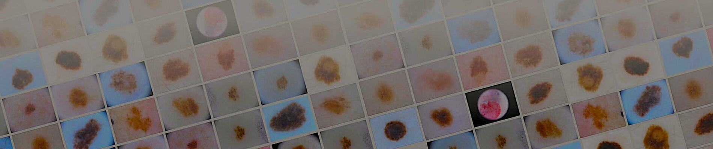

# 🔬 SIIM-ISIC-Melanoma-Classification

## 📝 Description

Skin cancer is the most prevalent type of cancer. Melanoma, specifically, is responsible for 75% of skin cancer deaths, despite being the least common skin cancer. The American Cancer Society estimates over 100,000 new melanoma cases will be diagnosed in 2020. It's also expected that almost 7,000 people will die from the disease. As with other cancers, early and accurate detection—potentially aided by data science—can make treatment more effective.

Currently, dermatologists evaluate every one of a patient's moles to identify outlier lesions or “ugly ducklings” that are most likely to be melanoma. Existing AI approaches have not adequately considered this clinical frame of reference. Dermatologists could enhance their diagnostic accuracy if detection algorithms take into account “contextual” images within the same patient to determine which images represent a melanoma. If successful, classifiers would be more accurate and could better support dermatological clinic work.

As the leading healthcare organization for informatics in medical imaging, the Society for [Imaging Informatics in Medicine (SIIM)](https://siim.org/)'s mission is to advance medical imaging informatics through education, research, and innovation in a multi-disciplinary community. SIIM is joined by the [International Skin Imaging Collaboration (ISIC)](https://www.isic-archive.com/), an international effort to improve melanoma diagnosis. The ISIC Archive contains the largest publicly available collection of quality-controlled dermoscopic images of skin lesions.

In this competition, you’ll identify melanoma in images of skin lesions. In particular, you’ll use images within the same patient and determine which are likely to represent a melanoma. Using patient-level contextual information may help the development of image analysis tools, which could better support clinical dermatologists.

Melanoma is a deadly disease, but if caught early, most melanomas can be cured with minor surgery. Image analysis tools that automate the diagnosis of melanoma will improve dermatologists' diagnostic accuracy. Better detection of melanoma has the opportunity to positively impact millions of people.

## 🔍 Evaluation

Submissions are evaluated on [area under the ROC curve](http://en.wikipedia.org/wiki/Receiver_operating_characteristic) between the predicted probability and the observed target.

**What is AUC - ROC Curve?**

AUC - ROC curve is a performance measurement for classification problem at various thresholds settings. ROC is a probability curve and AUC represents degree or measure of separability. It tells how much model is capable of distinguishing between classes. Higher the AUC, better the model is at predicting 0s as 0s and 1s as 1s. By analogy, Higher the AUC, better the model is at distinguishing between patients with disease and no disease.

The ROC curve is plotted with TPR against the FPR where TPR is on y-axis and FPR is on the x-axis.

▶ Here is the [link to a great video](https://youtu.be/4jRBRDbJemM) on roc-auc

## 📝 More About Melanoma

* The most serious type of skin cancer.
* Melanoma occurs when the pigment-producing cells that give colour to the skin become cancerous.
* Symptoms might include a new, unusual growth or a change in an existing mole. Melanomas can occur anywhere on the body.
* Treatment may involve surgery, radiation, medication or in some cases, chemotherapy.

### ✔ ABCDE Rule

Use the “ABCDE rule” to look for some of the common signs of melanoma, one of the deadliest forms of skin cancer:

### ✔ Ugly Duckling

The **Ugly Duckling** is another warning sign of melanoma. This recognition strategy is based on the concept that most normal moles on your body resemble one another, while melanomas stand out like ugly ducklings in comparison. This highlights the importance of not just checking for irregularities, but also comparing any suspicious spot to surrounding moles to determine whether it looks different from its neighbours. These ugly duckling lesions or outlier lesions can be larger, smaller, lighter or darker, compared to surrounding moles. Also, isolated lesions without any surrounding moles for comparison are considered ugly ducklings.

Melanomas commonly appear on the legs of women, and the number one place they develop on men is the trunk.

Many other factors also play a role in increasing the risk for melanoma, including genetics (family history), skin type or colour, hair colour, freckling and number of moles on the body.

### ✔ These factors increase your melanoma risk

* Unprotected or excessive UV exposure from the sun or indoor tanning.
* Weakened immune system due to a medical condition or medications.
* Many moles: The more moles you have on your body, the higher your risk for melanoma. Also, having large moles (larger than a tip of a pencil eraser), or any atypical moles, increases the risk for melanoma.
* Fair skin: Melanoma occurs more frequently in people with fair skin, light eyes and light or red hair.
* Skin cancer history: People who have already had melanoma or nonmelanoma skin cancers run a greater risk of developing melanoma in the future.
* Genetics: Melanoma can run in families – one in every 10 patients has a family member who also has had the disease.
