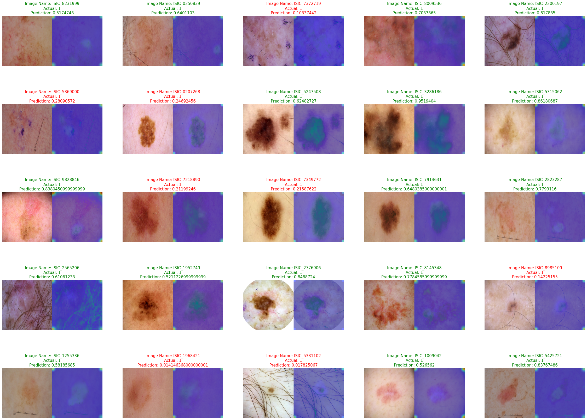
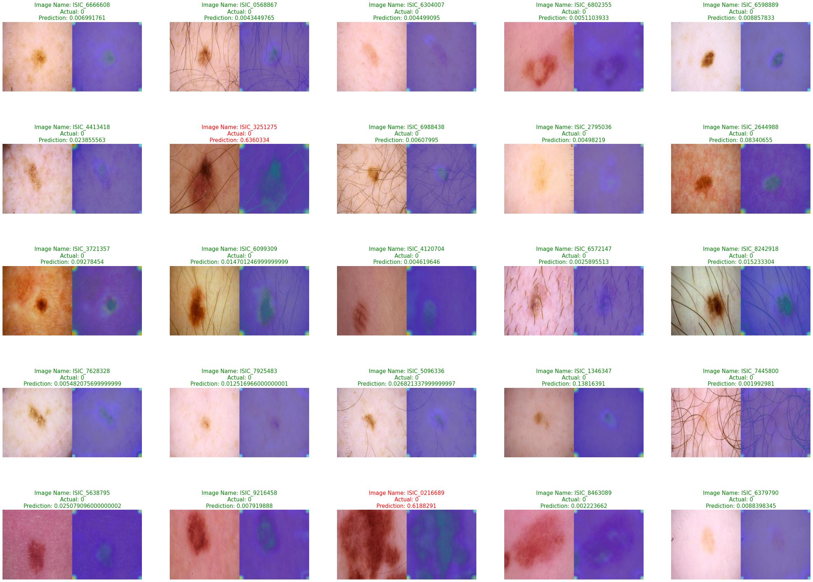
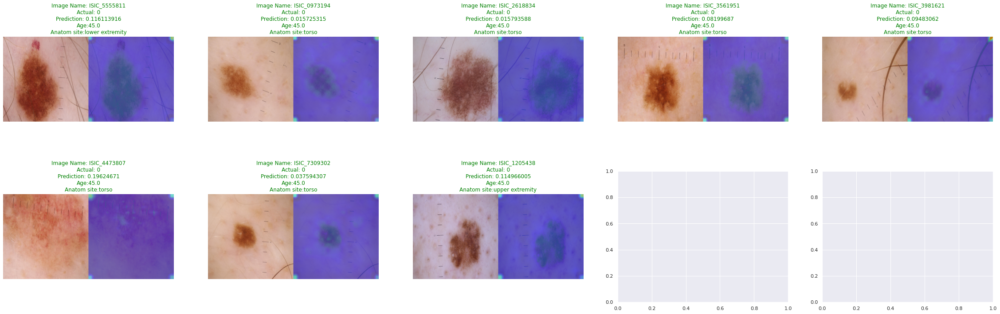

# ⁉ Model Interpretation

**TF-explain**  
**tf-explain** offers interpretability methods for Tensorflow 2.0 to ease neural network’s understanding. With either its core API or its tf.keras callbacks, you can get a feedback on the training of your models.

We have used **Core API** to visualize: What our Model is seeing in the Image to take the decision?  
**One can use it as a Callback during model training**

**GradCams**  
Gradient-weighted Class Activation Mapping(Grad-CAM) is a method that extracts gradients from a convolutional neural network's final convolutional layer(mostly) and uses this information to highlight regions most responsible for the predicted probability the image belongs to a predefined class.

The steps of Grad-CAM include extracting the gradients with subsequent global average pooling. A ReLU activation function is added to only depict the regions of the image that have a positive contribution to the predefined class. The resulting attention map can be plotted over the original image and can be interpreted as a visual tool for identifying regions the model ‘looks at’ to predict if an image belongs to a specific class. Readers interested in the mathematical theory behind Grad-CAM are encouraged to read the paper by Selvaraju et al. via https://arxiv.org/abs/1610.02391.

This demonstrates the relative ease of implementing Grad-CAM with our basic model using tf-explain.

## 🧪 Grad-CAM Results of EfficientNetB5

Here we are assuming the thereshold to be **0.5** to decide True-Positives, True-Negatives etc.

### GradCAMs of TP + FN in Validation Images

### GradCAMs of TN + FP in Validation Images

### GradCAMs of a Random Patient from Validation-set

## ✔ Helpful Resources

* [tf-explain docs](https://tf-explain.readthedocs.io/en/latest/)
* [Demystifying Convolutional Neural Networks using GradCam](https://towardsdatascience.com/demystifying-convolutional-neural-networks-using-gradcam-554a85dd4e48)
* [Grad-CAM class activation visualization | keras.io](https://keras.io/examples/vision/grad_cam/)
* [Grad-CAM: Visualize class activation maps with Keras, TensorFlow, and Deep Learning](https://www.pyimagesearch.com/2020/03/09/grad-cam-visualize-class-activation-maps-with-keras-tensorflow-and-deep-learning/)
* [Introducing tf-explain, Interpretability for TensorFlow 2.0](https://www.sicara.ai/blog/2019-07-31-tf-explain-interpretability-tensorflow)
* [Interpreting Tensorflow models with tf-explain](https://gilberttanner.com/blog/interpreting-tensorflow-model-with-tf-explain)
