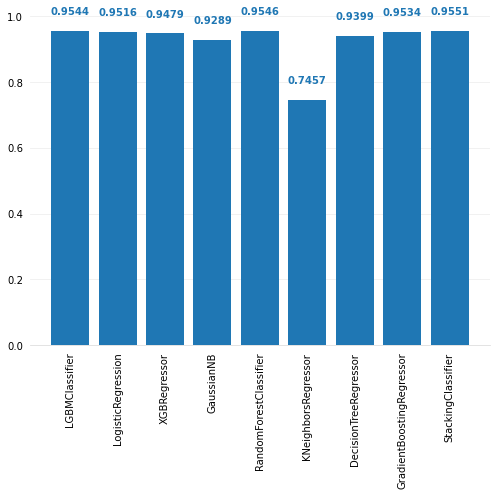
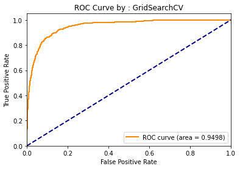
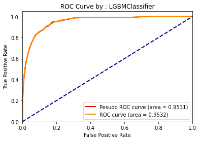
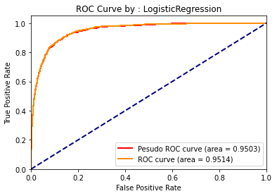
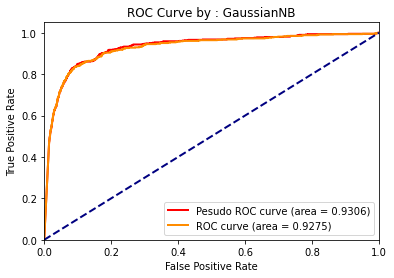
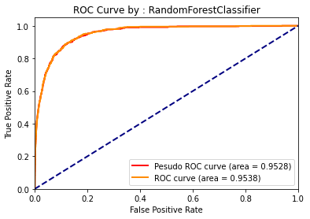
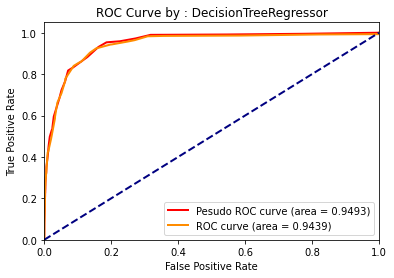
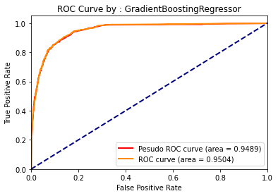
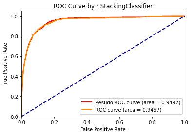
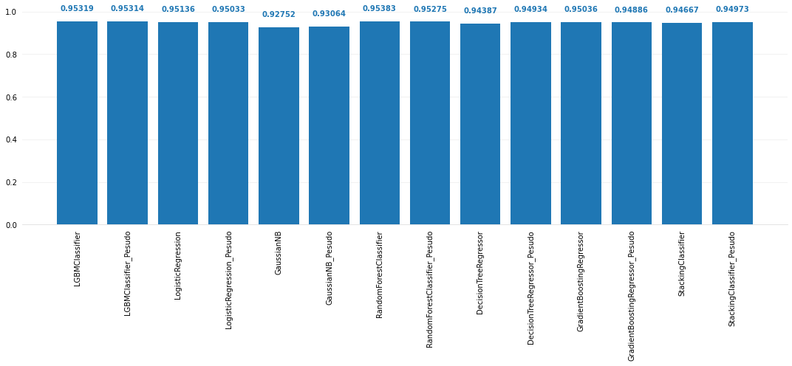

## Strategy

1. Split the train set in k folds [we have used [Chris Deotte](https://www.kaggle.com/cdeotte)'s TFrecords Id for spliting data]
2. Fit a first stage model on k-1 folds and predict the kth fold
3. Repeat 2) to predict each fold
4. We now have the (out-of-folds) prediction of the k folds
5. Split these out-of folds predictions in p folds
6. Fit a second stage (stacker) model on p-1 folds and predict the pth fold
7. Repeat 6) to predict each fold
8. The CV error of the second stage is calculated on each predicted fold

[reference](https://www.kaggle.com/general/18793)


## Import Libraries


```python
import re,os
import pandas as pd
import numpy as np
import matplotlib.pyplot as plt
%matplotlib inline
from colorama import Fore, Back, Style

import lightgbm as lgb # CLF1
from sklearn.linear_model import LogisticRegression # CLF2
from xgboost import XGBRegressor # CLF3
from sklearn.naive_bayes import GaussianNB  # CLF4
from sklearn.ensemble import RandomForestClassifier # CLF5
from sklearn.linear_model import LinearRegression # CLF6
from sklearn.linear_model import Lasso # CLF7
from sklearn.linear_model import ElasticNet # CLF8
from sklearn.neighbors import KNeighborsRegressor # CLF9
from sklearn.tree import DecisionTreeRegressor # CLF10
from sklearn.ensemble import GradientBoostingRegressor # CLF11
from sklearn.discriminant_analysis import QuadraticDiscriminantAnalysis #CLF12
from mlxtend.classifier import StackingClassifier # SCF

from sklearn.model_selection import GridSearchCV
from sklearn.model_selection import KFold
from sklearn.pipeline import Pipeline

from sklearn.metrics import roc_auc_score,roc_curve

import warnings
warnings.filterwarnings(action='ignore', category=DeprecationWarning, module='sklearn')
warnings.simplefilter('ignore')

from sklearn.preprocessing import StandardScaler
from sklearn.model_selection import cross_val_score

def seed_everything(SEED):
    np.random.seed(SEED)
    os.environ['PYTHONHASHSEED'] = str(SEED)
```


```python
FOLDS = 3
SEED = 123
Setup_Parameters = True
seed_everything(SEED)
file_add_list = [1,2,3,4,5]
pesudo_label = True
test_pipeline = True
```

## Import Metadata


```python
BASE_PATH = '../input/siim-isic-melanoma-classification'
train_metadata = pd.read_csv(os.path.join(BASE_PATH, 'train.csv'))
test_metadata = pd.read_csv(os.path.join(BASE_PATH, 'test.csv'))
sample_submission = pd.read_csv(os.path.join(BASE_PATH, 'sample_submission.csv'))
tfrecord_number_df =  pd.read_csv('../input/stacking-data/Image_Name_TFRecord_number.csv')
```

### Metadata-Size


```python
print('Train data shape : ',train_metadata.shape)
print('Test data shape : ',test_metadata.shape)
```

    Train data shape :  (33126, 8)
    Test data shape :  (10982, 5)
    

### Metadata-values [train_metadata]


```python
print('Unique values in column with frequency : ')

print('\nsex : ', dict(train_metadata.sex.value_counts()))
print('\nage_approx : ', dict(train_metadata.age_approx.value_counts()))
print('\nanatom_site_general_challenge : ', dict(train_metadata.anatom_site_general_challenge.value_counts()))
print('\ndiagnosis : ', dict(train_metadata.diagnosis.value_counts()))
print('\nbenign_malignant : ', dict(train_metadata.benign_malignant.value_counts()))
print('\ntarget : ', dict(train_metadata.target.value_counts()))
```

    Unique values in column with frequency : 
    
    sex :  {'male': 17080, 'female': 15981}
    
    age_approx :  {45.0: 4466, 50.0: 4270, 55.0: 3824, 40.0: 3576, 60.0: 3240, 35.0: 2850, 65.0: 2527, 30.0: 2358, 70.0: 1968, 25.0: 1544, 75.0: 981, 20.0: 655, 80.0: 419, 85.0: 149, 15.0: 132, 90.0: 80, 10.0: 17, 0.0: 2}
    
    anatom_site_general_challenge :  {'torso': 16845, 'lower extremity': 8417, 'upper extremity': 4983, 'head/neck': 1855, 'palms/soles': 375, 'oral/genital': 124}
    
    diagnosis :  {'unknown': 27124, 'nevus': 5193, 'melanoma': 584, 'seborrheic keratosis': 135, 'lentigo NOS': 44, 'lichenoid keratosis': 37, 'solar lentigo': 7, 'atypical melanocytic proliferation': 1, 'cafe-au-lait macule': 1}
    
    benign_malignant :  {'benign': 32542, 'malignant': 584}
    
    target :  {0: 32542, 1: 584}
    

### Metadata-values [test_metadata]


```python
print('Unique values in column with frequency : ')

print('\nsex : ', dict(test_metadata.sex.value_counts()))
print('\nage_approx : ', dict(test_metadata.age_approx.value_counts()))
print('\nanatom_site_general_challenge : ', dict(test_metadata.anatom_site_general_challenge.value_counts()))
```

    Unique values in column with frequency : 
    
    sex :  {'male': 6255, 'female': 4727}
    
    age_approx :  {45.0: 1587, 40.0: 1452, 55.0: 1265, 50.0: 1230, 35.0: 1032, 60.0: 1032, 70.0: 815, 65.0: 756, 30.0: 702, 25.0: 298, 80.0: 207, 75.0: 201, 20.0: 187, 85.0: 156, 15.0: 41, 90.0: 14, 10.0: 7}
    
    anatom_site_general_challenge :  {'torso': 5847, 'lower extremity': 2501, 'upper extremity': 1573, 'head/neck': 576, 'palms/soles': 108, 'oral/genital': 26}
    

## One-Hot encode Training Data


```python
train = train_metadata.copy()
train['age_approx'] = train['age_approx'].fillna(train.age_approx.mean())
sex_code = pd.get_dummies(train.sex, prefix='sex')
anatom_site_general_challenge_code = pd.get_dummies(train.anatom_site_general_challenge, prefix='anatom_site')
age_aprox_normalized = (train.age_approx-train.age_approx.mean())/train.age_approx.std()
train_coded = pd.concat([train.image_name, sex_code, age_aprox_normalized, anatom_site_general_challenge_code , train.target], axis=1)
print('Shape : ',train_coded.shape)
train_coded.tail()
```

    Shape :  (33126, 11)
    


<div>
<style scoped>
    .dataframe tbody tr th:only-of-type {
        vertical-align: middle;}
    .dataframe tbody tr th {
        vertical-align: top;}
    .dataframe thead th {
        text-align: right;}
</style>
<table border="1" class="dataframe">
  <thead>
    <tr style="text-align: right;">
      <th></th>
      <th>image_name</th>
      <th>sex_female</th>
      <th>sex_male</th>
      <th>age_approx</th>
      <th>anatom_site_head/neck</th>
      <th>anatom_site_lower extremity</th>
      <th>anatom_site_oral/genital</th>
      <th>anatom_site_palms/soles</th>
      <th>anatom_site_torso</th>
      <th>anatom_site_upper extremity</th>
      <th>target</th>
    </tr>
  </thead>
  <tbody>
    <tr>
      <th>33121</th>
      <td>ISIC_9999134</td>
      <td>0</td>
      <td>1</td>
      <td>0.078659</td>
      <td>0</td>
      <td>0</td>
      <td>0</td>
      <td>0</td>
      <td>1</td>
      <td>0</td>
      <td>0</td>
    </tr>
    <tr>
      <th>33122</th>
      <td>ISIC_9999320</td>
      <td>0</td>
      <td>1</td>
      <td>1.122821</td>
      <td>0</td>
      <td>0</td>
      <td>0</td>
      <td>0</td>
      <td>1</td>
      <td>0</td>
      <td>0</td>
    </tr>
    <tr>
      <th>33123</th>
      <td>ISIC_9999515</td>
      <td>0</td>
      <td>1</td>
      <td>-2.009664</td>
      <td>0</td>
      <td>1</td>
      <td>0</td>
      <td>0</td>
      <td>0</td>
      <td>0</td>
      <td>0</td>
    </tr>
    <tr>
      <th>33124</th>
      <td>ISIC_9999666</td>
      <td>0</td>
      <td>1</td>
      <td>0.078659</td>
      <td>0</td>
      <td>1</td>
      <td>0</td>
      <td>0</td>
      <td>0</td>
      <td>0</td>
      <td>0</td>
    </tr>
    <tr>
      <th>33125</th>
      <td>ISIC_9999806</td>
      <td>0</td>
      <td>1</td>
      <td>-0.269395</td>
      <td>0</td>
      <td>0</td>
      <td>0</td>
      <td>0</td>
      <td>1</td>
      <td>0</td>
      <td>0</td>
    </tr>
  </tbody>
</table>
</div>


## Add OOF Prediction Value to Train Metadata


```python
def add_OOF_pred(train_coded,num):
    for n in file_add_list:
        df_ = pd.read_csv(f'../input/95-cv-oof-submission/oof_{n}.csv')
        train_coded = pd.merge(train_coded, df_[['image_name','pred']], on="image_name",how='right')
        train_coded.rename({'pred': f'pred_{n}'}, axis=1, inplace=True)
    return train_coded
train_coded = pd.merge(tfrecord_number_df, train_coded, on="image_name",how='left')
train_coded = add_OOF_pred(train_coded,5)
train_coded.to_csv('train_coded.csv',index=False)
train_coded.tail()
```


<div>
<table border="1" class="dataframe">
  <thead>
    <tr style="text-align: right;">
      <th></th>
      <th>image_name</th>
      <th>tfrecord</th>
      <th>sex_female</th>
      <th>sex_male</th>
      <th>age_approx</th>
      <th>anatom_site_head/neck</th>
      <th>anatom_site_lower extremity</th>
      <th>anatom_site_oral/genital</th>
      <th>anatom_site_palms/soles</th>
      <th>anatom_site_torso</th>
      <th>anatom_site_upper extremity</th>
      <th>target</th>
      <th>pred_1</th>
      <th>pred_2</th>
      <th>pred_3</th>
      <th>pred_4</th>
      <th>pred_5</th>
    </tr>
  </thead>
  <tbody>
    <tr>
      <th>32687</th>
      <td>ISIC_9999134</td>
      <td>2</td>
      <td>0</td>
      <td>1</td>
      <td>0.078659</td>
      <td>0</td>
      <td>0</td>
      <td>0</td>
      <td>0</td>
      <td>1</td>
      <td>0</td>
      <td>0</td>
      <td>0.013214</td>
      <td>1.674429e-02</td>
      <td>0.008934</td>
      <td>3.828210e-02</td>
      <td>0.120159</td>
    </tr>
    <tr>
      <th>32688</th>
      <td>ISIC_9999320</td>
      <td>11</td>
      <td>0</td>
      <td>1</td>
      <td>1.122821</td>
      <td>0</td>
      <td>0</td>
      <td>0</td>
      <td>0</td>
      <td>1</td>
      <td>0</td>
      <td>0</td>
      <td>0.000937</td>
      <td>1.106820e-06</td>
      <td>0.000375</td>
      <td>1.375679e-10</td>
      <td>0.019903</td>
    </tr>
    <tr>
      <th>32689</th>
      <td>ISIC_9999515</td>
      <td>3</td>
      <td>0</td>
      <td>1</td>
      <td>-2.009664</td>
      <td>0</td>
      <td>1</td>
      <td>0</td>
      <td>0</td>
      <td>0</td>
      <td>0</td>
      <td>0</td>
      <td>0.001160</td>
      <td>4.173235e-07</td>
      <td>0.000502</td>
      <td>1.010386e-07</td>
      <td>0.021704</td>
    </tr>
    <tr>
      <th>32690</th>
      <td>ISIC_9999666</td>
      <td>11</td>
      <td>0</td>
      <td>1</td>
      <td>0.078659</td>
      <td>0</td>
      <td>1</td>
      <td>0</td>
      <td>0</td>
      <td>0</td>
      <td>0</td>
      <td>0</td>
      <td>0.002669</td>
      <td>1.003480e-03</td>
      <td>0.005216</td>
      <td>2.981703e-03</td>
      <td>0.056021</td>
    </tr>
    <tr>
      <th>32691</th>
      <td>ISIC_9999806</td>
      <td>4</td>
      <td>0</td>
      <td>1</td>
      <td>-0.269395</td>
      <td>0</td>
      <td>0</td>
      <td>0</td>
      <td>0</td>
      <td>1</td>
      <td>0</td>
      <td>0</td>
      <td>0.023055</td>
      <td>2.104348e-02</td>
      <td>0.032791</td>
      <td>1.837322e-01</td>
      <td>0.173365</td>
    </tr>
  </tbody>
</table>
</div>


## One-Hot encode Testing Data


```python
test = test_metadata.copy()
test['age_approx'] = test['age_approx'].fillna(test.age_approx.mean())
sex_code = pd.get_dummies(test.sex, prefix='sex')
anatom_site_general_challenge_code = pd.get_dummies(test.anatom_site_general_challenge, prefix='anatom_site')
age_aprox_normalized = (test.age_approx-test.age_approx.mean())/test.age_approx.std()
test_coded = pd.concat([test.image_name, sex_code, age_aprox_normalized , anatom_site_general_challenge_code], axis=1)
print('Shape : ',test_coded.shape)
test_coded.tail()
```

    Shape :  (10982, 10)
    


<div>
<table border="1" class="dataframe">
  <thead>
    <tr style="text-align: right;">
      <th></th>
      <th>image_name</th>
      <th>sex_female</th>
      <th>sex_male</th>
      <th>age_approx</th>
      <th>anatom_site_head/neck</th>
      <th>anatom_site_lower extremity</th>
      <th>anatom_site_oral/genital</th>
      <th>anatom_site_palms/soles</th>
      <th>anatom_site_torso</th>
      <th>anatom_site_upper extremity</th>
    </tr>
  </thead>
  <tbody>
    <tr>
      <th>10977</th>
      <td>ISIC_9992485</td>
      <td>0</td>
      <td>1</td>
      <td>-0.662853</td>
      <td>0</td>
      <td>0</td>
      <td>0</td>
      <td>0</td>
      <td>1</td>
      <td>0</td>
    </tr>
    <tr>
      <th>10978</th>
      <td>ISIC_9996992</td>
      <td>0</td>
      <td>1</td>
      <td>-1.010786</td>
      <td>0</td>
      <td>0</td>
      <td>0</td>
      <td>0</td>
      <td>1</td>
      <td>0</td>
    </tr>
    <tr>
      <th>10979</th>
      <td>ISIC_9997917</td>
      <td>0</td>
      <td>1</td>
      <td>-1.706652</td>
      <td>0</td>
      <td>0</td>
      <td>0</td>
      <td>0</td>
      <td>0</td>
      <td>1</td>
    </tr>
    <tr>
      <th>10980</th>
      <td>ISIC_9998234</td>
      <td>0</td>
      <td>1</td>
      <td>1.076811</td>
      <td>0</td>
      <td>1</td>
      <td>0</td>
      <td>0</td>
      <td>0</td>
      <td>0</td>
    </tr>
    <tr>
      <th>10981</th>
      <td>ISIC_9999302</td>
      <td>0</td>
      <td>1</td>
      <td>-1.358719</td>
      <td>0</td>
      <td>0</td>
      <td>0</td>
      <td>0</td>
      <td>0</td>
      <td>1</td>
    </tr>
  </tbody>
</table>
</div>


## Add Submission Target Value to Test Metadata


```python
def add_submission_pred(test_coded,num):
    for n in file_add_list:
        df_ = pd.read_csv(f'../input/95-cv-oof-submission/submission_{n}.csv')
        test_coded = pd.merge(test_coded, df_[['image_name','target']], on="image_name",how='right')
        test_coded.rename({'target': f'pred_{n}'}, axis=1, inplace=True)
    return test_coded
test_coded = add_submission_pred(test_coded,5)
test_coded.to_csv('test_coded.csv',index=False)
test_coded.tail()
```


<div>
<table border="1" class="dataframe">
  <thead>
    <tr style="text-align: right;">
      <th></th>
      <th>image_name</th>
      <th>sex_female</th>
      <th>sex_male</th>
      <th>age_approx</th>
      <th>anatom_site_head/neck</th>
      <th>anatom_site_lower extremity</th>
      <th>anatom_site_oral/genital</th>
      <th>anatom_site_palms/soles</th>
      <th>anatom_site_torso</th>
      <th>anatom_site_upper extremity</th>
      <th>pred_1</th>
      <th>pred_2</th>
      <th>pred_3</th>
      <th>pred_4</th>
      <th>pred_5</th>
    </tr>
  </thead>
  <tbody>
    <tr>
      <th>10977</th>
      <td>ISIC_9992485</td>
      <td>0</td>
      <td>1</td>
      <td>-0.662853</td>
      <td>0</td>
      <td>0</td>
      <td>0</td>
      <td>0</td>
      <td>1</td>
      <td>0</td>
      <td>0.000968</td>
      <td>0.000108</td>
      <td>0.000243</td>
      <td>3.511394e-05</td>
      <td>0.052316</td>
    </tr>
    <tr>
      <th>10978</th>
      <td>ISIC_9996992</td>
      <td>0</td>
      <td>1</td>
      <td>-1.010786</td>
      <td>0</td>
      <td>0</td>
      <td>0</td>
      <td>0</td>
      <td>1</td>
      <td>0</td>
      <td>0.011886</td>
      <td>0.017020</td>
      <td>0.000682</td>
      <td>3.613343e-02</td>
      <td>0.125994</td>
    </tr>
    <tr>
      <th>10979</th>
      <td>ISIC_9997917</td>
      <td>0</td>
      <td>1</td>
      <td>-1.706652</td>
      <td>0</td>
      <td>0</td>
      <td>0</td>
      <td>0</td>
      <td>0</td>
      <td>1</td>
      <td>0.040804</td>
      <td>0.050703</td>
      <td>0.000969</td>
      <td>1.127292e-01</td>
      <td>0.171867</td>
    </tr>
    <tr>
      <th>10980</th>
      <td>ISIC_9998234</td>
      <td>0</td>
      <td>1</td>
      <td>1.076811</td>
      <td>0</td>
      <td>1</td>
      <td>0</td>
      <td>0</td>
      <td>0</td>
      <td>0</td>
      <td>0.000985</td>
      <td>0.000002</td>
      <td>0.000127</td>
      <td>4.122612e-09</td>
      <td>0.013552</td>
    </tr>
    <tr>
      <th>10981</th>
      <td>ISIC_9999302</td>
      <td>0</td>
      <td>1</td>
      <td>-1.358719</td>
      <td>0</td>
      <td>0</td>
      <td>0</td>
      <td>0</td>
      <td>0</td>
      <td>1</td>
      <td>0.087687</td>
      <td>0.153389</td>
      <td>0.010256</td>
      <td>5.238238e-01</td>
      <td>0.285668</td>
    </tr>
  </tbody>
</table>
</div>


```python
def crossValidate(CLF,X=train_coded,X_test=test_coded,FOLDS = 5,SEED = 123,show_roc_curve = False,pesudo_label = False):
    print(Fore.YELLOW)
    print('#'*60)
    model_name = type(CLF).__name__
    print('#### ',model_name)
    print('#'*60,Style.RESET_ALL)
    
    CV_Score = []
    Val_preds = []
    Val_imagenames = []
    val_targets = []
    
    CV_Score_pesudo = []
    Val_preds_pesudo = []
    Val_imagenames_pesudo = []
    val_targets_pesudo = []
    
    skf = KFold(n_splits=FOLDS,shuffle=True,random_state=SEED)

    for fold,(idxT,idxV) in enumerate(skf.split(np.arange(15))):

        idxT, idxV = X.tfrecord.isin(idxT), X.tfrecord.isin(idxV)

        X_train_main, y_train_main = X[idxT], X[idxT]
        X_val_main, y_val_main = X[idxV], X[idxV]
        print(Fore.MAGENTA)
        print('#'*60,Style.RESET_ALL)
        print(Fore.BLUE)
        print('FOLD : ',fold)
        print('Train TFrecords : ',X_train_main.tfrecord.unique())
        print('Validation TFrecords : ',X_val_main.tfrecord.unique())
        image_names = list(X_val_main['image_name'])
        
        X_train = X_train_main.drop(['target','tfrecord'],axis=1).iloc[:,1:]
        y_train = y_train_main['target']
        
        X_val = X_val_main.drop(['target','tfrecord'],axis=1).iloc[:,1:]
        y_val = y_val_main['target']
        
        CLF_pesudo = CLF
        CLF.fit(X_train, y_train)
        
        try:
            y_train_pred  = CLF.predict_proba(X_train)[:,1]
        except:
            y_train_pred = CLF.predict(X_train)
            
        print('Train AUC : ', roc_auc_score(y_train,y_train_pred))
        try:
            Val_pred  = CLF.predict_proba(X_val)[:,1]
        except:
            Val_pred = CLF.predict(X_val)
            
        Val_auc = roc_auc_score(y_val,Val_pred)
        print('Val AUC : ', Val_auc)
        
        CV_Score.append(Val_auc)
        Val_preds.append(Val_pred)
        Val_imagenames.append(image_names)
        val_targets.append(list(y_val))
        
        if pesudo_label:
            
            train2_Pesudo = X_train_main.copy()
            train2_Pesudo['target_label'] = y_train_main['target']
            test2_Pesudo = X_val_main.copy()
            test2_Pesudo['target_label'] = Val_pred
            
            test2_Pesudo = test2_Pesudo[ (test2_Pesudo['target_label'] >= 0.99) |  
                                            (test2_Pesudo['target_label'] >= 0.01)]
            test2_Pesudo.loc[ test2_Pesudo['target_label']>=0.5, 'target_label' ] = 1
            test2_Pesudo.loc[ test2_Pesudo['target_label']<0.5, 'target_label' ] = 0
            
            print(Fore.CYAN)
            print('Number of Pesudo Labeled Data added : ',len(test2_Pesudo))
            print('target_label = 1 : ',len(test2_Pesudo[test2_Pesudo['target_label'] == 1]))
            print('target_label = 0 : ',len(test2_Pesudo[test2_Pesudo['target_label'] == 0]))
            
            train_pesudo = pd.concat([train2_Pesudo,test2_Pesudo],axis=0)
            
            X_train_pesudo = train_pesudo.drop(['target_label','target','tfrecord'],axis=1).iloc[:,1:]
            y_train_pesudo = train_pesudo['target_label']
            
            CLF_pesudo.fit(X_train_pesudo, y_train_pesudo)
            
            try:
                y_train_pred_pesudo  = CLF_pesudo.predict_proba(X_train_pesudo)[:,1]
            except:
                y_train_pred_pesudo = CLF_pesudo.predict(X_train_pesudo)

            print('Pesudo Train AUC : ', roc_auc_score(y_train_pesudo,y_train_pred_pesudo))
            try:
                Val_pred_pesudo  = CLF_pesudo.predict_proba(X_val)[:,1]
            except:
                Val_pred_pesudo = CLF_pesudo.predict(X_val)
            
            Val_auc_pesudo = roc_auc_score(y_val,Val_pred_pesudo)
            print('Pesudo Val AUC : ', Val_auc_pesudo)
            print(Style.RESET_ALL)
            
            CV_Score_pesudo.append(Val_auc_pesudo)
            Val_preds_pesudo.append(Val_pred_pesudo)
            Val_imagenames_pesudo.append(image_names)
            val_targets_pesudo.append(list(y_val))
            
    valtargets = np.concatenate(val_targets)
    valpreds = np.concatenate(Val_preds)
    valimagenames = np.concatenate(Val_imagenames)
    
    auc_score = roc_auc_score(valtargets,valpreds)
    
    print(Fore.YELLOW)
    print('#'*60)
    print('\nCV(auc_score) : ',auc_score)
    print(f'Mean CV : {np.mean(CV_Score)} +/- {np.std(CV_Score)}\n')
    
    
    oof = pd.DataFrame()
    oof['image_name'] = valimagenames
    oof['pred'] = valpreds
    oof['target'] = valtargets
    
    
    ## Test data Prediction
    Test_imagenames = X_test['image_name']
    X_test = X_test.iloc[:,1:]
    try:
        test_pred = CLF.predict_proba(X_test)[:,1]
    except:
        test_pred = CLF.predict(X_test)
        
    submission = pd.DataFrame()
    submission['image_name'] = Test_imagenames
    submission['target'] = test_pred
    
    if pesudo_label:
        valtargets_pesudo = np.concatenate(val_targets_pesudo)
        valpreds_pesudo = np.concatenate(Val_preds_pesudo)
        valimagenames_pesudo = np.concatenate(Val_imagenames_pesudo)
        
        auc_score_pesudo = roc_auc_score(valtargets_pesudo,valpreds_pesudo)
        
        print('Pesudo CV(auc_score) : ',auc_score_pesudo)
        print(f'Pesudo Mean CV : {np.mean(CV_Score_pesudo)} +/- {np.std(CV_Score_pesudo)}\n')
        
        oof_pesudo = pd.DataFrame()
        oof_pesudo['image_name'] = valimagenames_pesudo
        oof_pesudo['pred'] = valpreds_pesudo
        oof_pesudo['target'] = valtargets_pesudo
        
        ## Test data Prediction (Pesudo)
        try:
            test_pred_pesudo = CLF_pesudo.predict_proba(X_test)[:,1]
        except:
            test_pred_pesudo = CLF_pesudo.predict(X_test)

        submission_pesudo = pd.DataFrame()
        submission_pesudo['image_name'] = Test_imagenames
        submission_pesudo['target'] = test_pred_pesudo
        
    
    print('#'*60,Style.RESET_ALL)
    if show_roc_curve:
        fpr, tpr, _ = roc_curve(valtargets,valpreds)
        if pesudo_label:
            fpr_p, tpr_p, _ = roc_curve(valtargets_pesudo,valpreds_pesudo)
            
        plt.figure()
        lw = 2
        if pesudo_label:
            plt.plot(fpr_p, tpr_p, color='red',
                 lw=lw, label=f'Pesudo ROC curve (area = {auc_score_pesudo:0.4f})')
            
        plt.plot(fpr, tpr, color='darkorange',
                 lw=lw, label=f'ROC curve (area = {auc_score:0.4f})')
        
        plt.plot([0, 1], [0, 1], color='navy', lw=lw, linestyle='--')
        plt.xlim([0.0, 1.0])
        plt.ylim([0.0, 1.05])
        plt.xlabel('False Positive Rate')
        plt.ylabel('True Positive Rate')
        plt.title(f'ROC Curve by : {model_name}')
        plt.legend(loc="lower right")
        plt.show()
    
    if pesudo_label:
        return oof , submission, auc_score, model_name, oof_pesudo, submission_pesudo, auc_score_pesudo, str(model_name) + '_Pesudo'
    return oof , submission, auc_score, model_name
```

# **Classifiers**

## LGBMClassifier


```python
clf1 = lgb.LGBMClassifier(max_depth=5, 
                          metric="auc", 
                          n_estimators=100, 
                          num_leaves=5, 
                          boosting_type="gbdt", 
                          learning_rate=0.1, 
                          feature_fraction=0.05, 
                          colsample_bytree=0.1, 
                          bagging_fraction=0.8, 
                          bagging_freq=2, 
                          reg_lambda=0.2)
```

## LogisticRegression


```python
clf2 = LogisticRegression(
            C= 1.0,
            class_weight=None,
            dual= False,
            fit_intercept= True,
            intercept_scaling= 1,
            l1_ratio= None,
            max_iter= 100,
            multi_class= 'auto',
            n_jobs= None,
            penalty= 'l2',
            random_state= None,
            solver= 'lbfgs',
            tol= 0.0001,
            verbose= 0,
            warm_start= False)
```

## XGBRegressor


```python
clf3 = XGBRegressor(base_score=0.5, 
                    booster=None, 
                    colsample_bylevel=1,
                    colsample_bynode=1, 
                    colsample_bytree=0.8, 
                    gamma=1, 
                    gpu_id=-1,
                    importance_type='gain', 
                    interaction_constraints=None,
                    learning_rate=0.002, 
                    max_delta_step=0, 
                    max_depth=10,
                    min_child_weight=1, 
                    missing=None, 
                    monotone_constraints=None,
                    n_estimators=700, 
                    n_jobs=-1, 
                    nthread=-1, 
                    num_parallel_tree=1,
                    objective='binary:logistic', 
                    random_state=0,
                    reg_alpha=0, 
                    reg_lambda=1, 
                    scale_pos_weight=1,
                    subsample=0.8,
                    tree_method=None, 
                    validate_parameters=False, 
                    verbosity=None)
```

## GaussianNB


```python
clf4 = GaussianNB(
    priors= None, 
    var_smoothing= 1e-09)
```

## RandomForestClassifier


```python
clf5 = RandomForestClassifier(
        bootstrap= True,
        ccp_alpha= 0.0,
        class_weight= None,
        criterion= 'gini',
        max_depth= 5,
        max_features= 'auto',
        max_leaf_nodes= 30,
        max_samples= None,
        min_impurity_decrease= 0.0,
        min_impurity_split= None,
        min_samples_leaf= 2,
        min_samples_split= 100,
        min_weight_fraction_leaf= 0.0,
        n_estimators= 300,
        n_jobs= None,
        oob_score= False,
        random_state= None,
        verbose= 0,
        warm_start= False)
```

## LinearRegression


```python
# clf6 = LinearRegression()
```

## Lasso


```python
# clf7 = Lasso()
```

## ElasticNet


```python
# clf8 = ElasticNet()
```

## KNeighborsRegressor


```python
clf9 = KNeighborsRegressor(algorithm= 'auto',
                            leaf_size= 30,
                            metric= 'minkowski',
                            metric_params= None,
                            n_jobs= None,
                            n_neighbors= 10,
                            p= 5,
                            weights= 'uniform')
```

##  DecisionTreeRegressor


```python
clf10 = DecisionTreeRegressor(ccp_alpha= 0.0,
                             criterion= 'mse',
                             max_depth= 5,
                             max_features= 'auto',
                             max_leaf_nodes= 30,
                             min_impurity_decrease= 0.0,
                             min_impurity_split= None,
                             min_samples_leaf= 2,
                             min_samples_split= 100,
                             min_weight_fraction_leaf= 0.0,
                             presort= 'deprecated',
                             random_state= SEED,
                             splitter= 'best')
```

## GradientBoostingRegressor


```python
clf11 = GradientBoostingRegressor()
```

## StackingClassifier


```python
SCF = StackingClassifier(classifiers=[clf1, clf5], 
                         meta_classifier=clf2,
                         use_probas=True,
                         average_probas=True)
```


```python
if test_pipeline:
    pipelines = []
    pipelines.append(('LGBMClassifier', Pipeline([('LGBMClassifier',clf1)])))
    pipelines.append(('LogisticRegression', Pipeline([('LogisticRegression',clf2)])))
    pipelines.append(('XGBRegressor', Pipeline([('XGBRegressor',clf3)])))
    pipelines.append(('GaussianNB', Pipeline([('GaussianNB',clf4)])))
    pipelines.append(('RandomForestClassifier', Pipeline([('RandomForestClassifier',clf5)])))
    # pipelines.append(('LinearRegression', Pipeline([('LinearRegression',clf6)])))
    # pipelines.append(('Lasso', Pipeline([('Lasso', clf7)])))
    # pipelines.append(('ElasticNet', Pipeline([('ElasticNet', clf8)])))
    pipelines.append(('KNeighborsRegressor', Pipeline([('KNeighborsRegressor', clf9)])))
    pipelines.append(('DecisionTreeRegressor', Pipeline([('DecisionTreeRegressor', clf10)])))
    pipelines.append(('GradientBoostingRegressor', Pipeline([('GradientBoostingRegressor', clf11)])))
    pipelines.append(('StackingClassifier', Pipeline([('StackingClassifier', SCF)])))

    X_train = train_coded.drop('target',axis=1).iloc[:,1:]
    y_train = train_coded['target']

    M_name = []
    M_auc_score = []
    for name, model in pipelines:
        cv_results = cross_val_score(model, X_train, y_train, cv=FOLDS, scoring='roc_auc')
        M_auc_score.append(np.mean(cv_results))
        M_name.append(name)
        print("%s: %f +/- %f" % (name, cv_results.mean(), cv_results.std()))
```

    LGBMClassifier: 0.954394 +/- 0.001650
    LogisticRegression: 0.951628 +/- 0.001351
    XGBRegressor: 0.947928 +/- 0.005033
    GaussianNB: 0.928950 +/- 0.006306
    RandomForestClassifier: 0.954569 +/- 0.000996
    KNeighborsRegressor: 0.745704 +/- 0.012084
    DecisionTreeRegressor: 0.939912 +/- 0.013673
    GradientBoostingRegressor: 0.953355 +/- 0.001779
    StackingClassifier: 0.955100 +/- 0.001182
    


```python
if test_pipeline:
    fig, ax = plt.subplots(figsize=(7,7))

    # Save the chart so we can loop through the bars below.
    bars = ax.bar(
        x=M_name,
        height=M_auc_score,
        tick_label=M_name
    )

    # Axis formatting.
    ax.spines['top'].set_visible(False)
    ax.spines['right'].set_visible(False)
    ax.spines['left'].set_visible(False)
    ax.spines['bottom'].set_color('#DDDDDD')
    ax.tick_params(bottom=False, left=False)
    ax.set_axisbelow(True)
    ax.yaxis.grid(True, color='#EEEEEE')
    ax.xaxis.grid(False)

    bar_color = bars[0].get_facecolor()
    plt.xticks(rotation=90)

    for bar in bars:
        ax.text(
          bar.get_x() + bar.get_width() / 2,
          bar.get_height() + 0.05,
          round(bar.get_height(), 4),
          horizontalalignment='center',
          color=bar_color,
          weight='bold'
        )

    fig.tight_layout()
```





## Setup Parameters With GridSearchCV


```python
select_classifier = clf2
select_classifier.get_params()
```


    {'C': 1.0,
     'class_weight': None,
     'dual': False,
     'fit_intercept': True,
     'intercept_scaling': 1,
     'l1_ratio': None,
     'max_iter': 100,
     'multi_class': 'auto',
     'n_jobs': None,
     'penalty': 'l2',
     'random_state': None,
     'solver': 'lbfgs',
     'tol': 0.0001,
     'verbose': 0,
     'warm_start': False}


```python
if Setup_Parameters:

    X_train = train_coded.drop('target',axis=1).iloc[:,1:]
    y_train = train_coded['target']

    params = dict(
        C = [0.001, 0.01, 0.1, 1, 10],
        max_iter = [100,150,50]
    )

    grid = GridSearchCV(estimator=select_classifier,
                        param_grid=params, 
                        cv=FOLDS,
                        scoring='roc_auc',
                        refit='AUC',
                        n_jobs = -1)

    grid.fit(X_train, y_train)

    for r, _ in enumerate(grid.cv_results_['mean_test_score']):
        print("AUC : %0.5f +/- %0.5f %r"
              % (grid.cv_results_['mean_test_score'][r],
                 grid.cv_results_['std_test_score'][r] / 2.0,
                 grid.cv_results_['params'][r]))

    print(f'\nBest parameters: {grid.best_params_}')

    oof, submission, auc_score, model_name = crossValidate(grid,X=train_coded,X_test=test_coded,FOLDS=FOLDS,SEED=SEED,show_roc_curve=True)
```

    AUC : 0.82639 +/- 0.00612 {'C': 0.001, 'max_iter': 100}
    AUC : 0.82639 +/- 0.00612 {'C': 0.001, 'max_iter': 150}
    AUC : 0.82639 +/- 0.00612 {'C': 0.001, 'max_iter': 50}
    AUC : 0.90657 +/- 0.00328 {'C': 0.01, 'max_iter': 100}
    AUC : 0.90657 +/- 0.00328 {'C': 0.01, 'max_iter': 150}
    AUC : 0.90657 +/- 0.00328 {'C': 0.01, 'max_iter': 50}
    AUC : 0.94524 +/- 0.00157 {'C': 0.1, 'max_iter': 100}
    AUC : 0.94524 +/- 0.00157 {'C': 0.1, 'max_iter': 150}
    AUC : 0.94527 +/- 0.00157 {'C': 0.1, 'max_iter': 50}
    AUC : 0.95163 +/- 0.00069 {'C': 1, 'max_iter': 100}
    AUC : 0.95173 +/- 0.00067 {'C': 1, 'max_iter': 150}
    AUC : 0.95028 +/- 0.00151 {'C': 1, 'max_iter': 50}
    AUC : 0.95194 +/- 0.00022 {'C': 10, 'max_iter': 100}
    AUC : 0.95136 +/- 0.00030 {'C': 10, 'max_iter': 150}
    AUC : 0.95001 +/- 0.00101 {'C': 10, 'max_iter': 50}
    
    Best parameters: {'C': 10, 'max_iter': 100}
    
    ############################################################
    ####  GridSearchCV
    ############################################################ 
    
    ############################################################ 
    
    FOLD :  0
    Train TFrecords :  [ 6 11  1 14  9  3 13 12  8  2]
    Validation TFrecords :  [ 0 10  4  5  7]
    Train AUC :  0.9521223667175769
    Val AUC :  0.9484942862495317
    
    ############################################################ 
    
    FOLD :  1
    Train TFrecords :  [ 0  6 14 10  4 13 12  5  2  7]
    Validation TFrecords :  [11  1  9  3  8]
    Train AUC :  0.9507561455888845
    Val AUC :  0.9547047676544078
    
    ############################################################ 
    
    FOLD :  2
    Train TFrecords :  [ 0 11  1  9 10  3  4  8  5  7]
    Validation TFrecords :  [ 6 14 13 12  2]
    Train AUC :  0.9567643052849683
    Val AUC :  0.951409408609381
    
    ############################################################
    
    CV(auc_score) :  0.9498353146902061
    Mean CV : 0.9515361541711068 +/- 0.002537001924600627
    
    ############################################################ 
    





## Training and Predictions


```python
M_name = []
M_auc_score = []
for CLF in [clf1,clf2,clf4,clf5,clf10,clf11,SCF]:
    if pesudo_label:
        oof, submission, auc_score, model_name, \
        pesudo_oof, pesudo_submission, pesudo_auc_score, pesudo_model_name = crossValidate(CLF,X=train_coded,
                                                                                           X_test=test_coded,
                                                                                           FOLDS=FOLDS,SEED=SEED,
                                                                                           show_roc_curve=True,
                                                                                           pesudo_label=True)
    else:
        oof, submission, auc_score, model_name = crossValidate(CLF,X=train_coded,X_test=test_coded,FOLDS=FOLDS,SEED=SEED,show_roc_curve=True,pesudo_label=False)
    
    oof.to_csv(f'oof_{model_name}_{auc_score:0.4f}.csv',index=False)
    submission.to_csv(f'submission_{model_name}_{auc_score:0.4f}.csv',index=False)
    M_name.append(model_name)
    M_auc_score.append(auc_score)
    
    if pesudo_label:
        pesudo_oof.to_csv(f'Pesudo_oof_{model_name}_{pesudo_auc_score:0.4f}.csv',index=False)
        pesudo_submission.to_csv(f'Pesudo_submission_{model_name}_{pesudo_auc_score:0.4f}.csv',index=False)
        M_name.append(pesudo_model_name)
        M_auc_score.append(pesudo_auc_score)
```

    
    ############################################################
    ####  LGBMClassifier
    ############################################################ 
    
    ############################################################ 
    
    FOLD :  0
    Train TFrecords :  [ 6 11  1 14  9  3 13 12  8  2]
    Validation TFrecords :  [ 0 10  4  5  7]
    Train AUC :  0.9685172425992854
    Val AUC :  0.9509630733264642
    
    Number of Pesudo Labeled Data added :  1998
    target_label = 1 :  54
    target_label = 0 :  1944
    Pesudo Train AUC :  0.9612131413491898
    Pesudo Val AUC :  0.9520548914231297
    
    
    ############################################################ 
    
    FOLD :  1
    Train TFrecords :  [ 0  6 14 10  4 13 12  5  2  7]
    Validation TFrecords :  [11  1  9  3  8]
    Train AUC :  0.9661900640504348
    Val AUC :  0.9582532575338332
    
    Number of Pesudo Labeled Data added :  2443
    target_label = 1 :  91
    target_label = 0 :  2352
    Pesudo Train AUC :  0.9596327531075959
    Pesudo Val AUC :  0.9577403411935786
    
    
    ############################################################ 
    
    FOLD :  2
    Train TFrecords :  [ 0 11  1  9 10  3  4  8  5  7]
    Validation TFrecords :  [ 6 14 13 12  2]
    Train AUC :  0.9664934183403188
    Val AUC :  0.952838797929691
    
    Number of Pesudo Labeled Data added :  1992
    target_label = 1 :  82
    target_label = 0 :  1910
    Pesudo Train AUC :  0.9616648726701964
    Pesudo Val AUC :  0.951826073675029
    
    
    ############################################################
    
    CV(auc_score) :  0.9531888124085071
    Mean CV : 0.9540183762633294 +/- 0.0030908736875124147
    
    Pesudo CV(auc_score) :  0.9531433590593215
    Pesudo Mean CV : 0.9538737687639124 +/- 0.0027356749509462887
    
    ############################################################ 
    





    
    ############################################################
    ####  LogisticRegression
    ############################################################ 
    
    ############################################################ 
    
    FOLD :  0
    Train TFrecords :  [ 6 11  1 14  9  3 13 12  8  2]
    Validation TFrecords :  [ 0 10  4  5  7]
    Train AUC :  0.9512679872130906
    Val AUC :  0.9484879441426253
    
    Number of Pesudo Labeled Data added :  1329
    target_label = 1 :  69
    target_label = 0 :  1260
    Pesudo Train AUC :  0.9443429145368957
    Pesudo Val AUC :  0.9454281214874486
    
    
    ############################################################ 
    
    FOLD :  1
    Train TFrecords :  [ 0  6 14 10  4 13 12  5  2  7]
    Validation TFrecords :  [11  1  9  3  8]
    Train AUC :  0.9517251068798068
    Val AUC :  0.956686958125807
    
    Number of Pesudo Labeled Data added :  1575
    target_label = 1 :  101
    target_label = 0 :  1474
    Pesudo Train AUC :  0.9482988969208511
    Pesudo Val AUC :  0.9553295625238073
    
    
    ############################################################ 
    
    FOLD :  2
    Train TFrecords :  [ 0 11  1  9 10  3  4  8  5  7]
    Validation TFrecords :  [ 6 14 13 12  2]
    Train AUC :  0.9567568116361379
    Val AUC :  0.9514161328870975
    
    Number of Pesudo Labeled Data added :  1388
    target_label = 1 :  74
    target_label = 0 :  1314
    Pesudo Train AUC :  0.9515730719756196
    Pesudo Val AUC :  0.9516332309962307
    
    
    ############################################################
    
    CV(auc_score) :  0.9513617539332556
    Mean CV : 0.9521970117185098 +/- 0.0033924707206904724
    
    Pesudo CV(auc_score) :  0.9503334255085802
    Pesudo Mean CV : 0.9507969716691621 +/- 0.004085268730100367
    
    ############################################################ 
    





    
    ############################################################
    ####  GaussianNB
    ############################################################ 
    
    ############################################################ 
    
    FOLD :  0
    Train TFrecords :  [ 6 11  1 14  9  3 13 12  8  2]
    Validation TFrecords :  [ 0 10  4  5  7]
    Train AUC :  0.9256070993611942
    Val AUC :  0.9238544691363808
    
    Number of Pesudo Labeled Data added :  648
    target_label = 1 :  519
    target_label = 0 :  129
    Pesudo Train AUC :  0.9605146793848778
    Pesudo Val AUC :  0.9338989029130761
    
    
    ############################################################ 
    
    FOLD :  1
    Train TFrecords :  [ 0  6 14 10  4 13 12  5  2  7]
    Validation TFrecords :  [11  1  9  3  8]
    Train AUC :  0.9251242332535606
    Val AUC :  0.9395189941952532
    
    Number of Pesudo Labeled Data added :  758
    target_label = 1 :  606
    target_label = 0 :  152
    Pesudo Train AUC :  0.9571287133805135
    Pesudo Val AUC :  0.9346056820876966
    
    
    ############################################################ 
    
    FOLD :  2
    Train TFrecords :  [ 0 11  1  9 10  3  4  8  5  7]
    Validation TFrecords :  [ 6 14 13 12  2]
    Train AUC :  0.9342112022072906
    Val AUC :  0.9194426726506335
    
    Number of Pesudo Labeled Data added :  734
    target_label = 1 :  597
    target_label = 0 :  137
    Pesudo Train AUC :  0.9617760114613139
    Pesudo Val AUC :  0.923659755389989
    
    
    ############################################################
    
    CV(auc_score) :  0.9275183366475508
    Mean CV : 0.9276053786607559 +/- 0.008614586985099777
    
    Pesudo CV(auc_score) :  0.9306419947888377
    Pesudo Mean CV : 0.9307214467969205 +/- 0.005001699600833527
    
    ############################################################ 
    





    
    ############################################################
    ####  RandomForestClassifier
    ############################################################ 
    
    ############################################################ 
    
    FOLD :  0
    Train TFrecords :  [ 6 11  1 14  9  3 13 12  8  2]
    Validation TFrecords :  [ 0 10  4  5  7]
    Train AUC :  0.9675517481859128
    Val AUC :  0.955173988385163
    
    Number of Pesudo Labeled Data added :  1948
    target_label = 1 :  55
    target_label = 0 :  1893
    Pesudo Train AUC :  0.9595161326449907
    Pesudo Val AUC :  0.9540872927594604
    
    
    ############################################################ 
    
    FOLD :  1
    Train TFrecords :  [ 0  6 14 10  4 13 12  5  2  7]
    Validation TFrecords :  [11  1  9  3  8]
    Train AUC :  0.9646955982752078
    Val AUC :  0.958827743000405
    
    Number of Pesudo Labeled Data added :  2406
    target_label = 1 :  92
    target_label = 0 :  2314
    Pesudo Train AUC :  0.959625732729077
    Pesudo Val AUC :  0.9593418571835838
    
    
    ############################################################ 
    
    FOLD :  2
    Train TFrecords :  [ 0 11  1  9 10  3  4  8  5  7]
    Validation TFrecords :  [ 6 14 13 12  2]
    Train AUC :  0.9675295361564326
    Val AUC :  0.9509555198635165
    
    Number of Pesudo Labeled Data added :  1997
    target_label = 1 :  68
    target_label = 0 :  1929
    Pesudo Train AUC :  0.9608897666603176
    Pesudo Val AUC :  0.949096737380452
    
    
    ############################################################
    
    CV(auc_score) :  0.9538292061460003
    Mean CV : 0.9549857504163614 +/- 0.003216576796214115
    
    Pesudo CV(auc_score) :  0.9527529319420249
    Pesudo Mean CV : 0.9541752957744988 +/- 0.0041830155265567895
    
    ############################################################ 
    





    
    ############################################################
    ####  DecisionTreeRegressor
    ############################################################ 
    
    ############################################################ 
    
    FOLD :  0
    Train TFrecords :  [ 6 11  1 14  9  3 13 12  8  2]
    Validation TFrecords :  [ 0 10  4  5  7]
    Train AUC :  0.9606944651822962
    Val AUC :  0.9486555221212688
    
    Number of Pesudo Labeled Data added :  1961
    target_label = 1 :  77
    target_label = 0 :  1884
    Pesudo Train AUC :  0.9551963741552827
    Pesudo Val AUC :  0.9486677184807044
    
    
    ############################################################ 
    
    FOLD :  1
    Train TFrecords :  [ 0  6 14 10  4 13 12  5  2  7]
    Validation TFrecords :  [11  1  9  3  8]
    Train AUC :  0.9538821863116397
    Val AUC :  0.953569931267773
    
    Number of Pesudo Labeled Data added :  2919
    target_label = 1 :  96
    target_label = 0 :  2823
    Pesudo Train AUC :  0.9495233121865941
    Pesudo Val AUC :  0.9560966611326323
    
    
    ############################################################ 
    
    FOLD :  2
    Train TFrecords :  [ 0 11  1  9 10  3  4  8  5  7]
    Validation TFrecords :  [ 6 14 13 12  2]
    Train AUC :  0.9609925362048996
    Val AUC :  0.9285178058873934
    
    Number of Pesudo Labeled Data added :  2051
    target_label = 1 :  89
    target_label = 0 :  1962
    Pesudo Train AUC :  0.9573507630206017
    Pesudo Val AUC :  0.9469788300525263
    
    
    ############################################################
    
    CV(auc_score) :  0.9438722962426321
    Mean CV : 0.9435810864254784 +/- 0.010838655197689387
    
    Pesudo CV(auc_score) :  0.9493428319398326
    Pesudo Mean CV : 0.9505810698886209 +/- 0.0039605888542798735
    
    ############################################################ 
    





    
    ############################################################
    ####  GradientBoostingRegressor
    ############################################################ 
    
    ############################################################ 
    
    FOLD :  0
    Train TFrecords :  [ 6 11  1 14  9  3 13 12  8  2]
    Validation TFrecords :  [ 0 10  4  5  7]
    Train AUC :  0.971387940944195
    Val AUC :  0.9454642227113775
    
    Number of Pesudo Labeled Data added :  1898
    target_label = 1 :  56
    target_label = 0 :  1842
    Pesudo Train AUC :  0.9651691185734292
    Pesudo Val AUC :  0.9437950289590359
    
    
    ############################################################ 
    
    FOLD :  1
    Train TFrecords :  [ 0  6 14 10  4 13 12  5  2  7]
    Validation TFrecords :  [11  1  9  3  8]
    Train AUC :  0.9670435172169428
    Val AUC :  0.9584868369041031
    
    Number of Pesudo Labeled Data added :  2331
    target_label = 1 :  94
    target_label = 0 :  2237
    Pesudo Train AUC :  0.9656611686755481
    Pesudo Val AUC :  0.957828262864234
    
    
    ############################################################ 
    
    FOLD :  2
    Train TFrecords :  [ 0 11  1  9 10  3  4  8  5  7]
    Validation TFrecords :  [ 6 14 13 12  2]
    Train AUC :  0.971710690040566
    Val AUC :  0.9506176249082616
    
    Number of Pesudo Labeled Data added :  2020
    target_label = 1 :  70
    target_label = 0 :  1950
    Pesudo Train AUC :  0.9657140139717725
    Pesudo Val AUC :  0.9507545119903478
    
    
    ############################################################
    
    CV(auc_score) :  0.9503614586472882
    Mean CV : 0.9515228948412474 +/- 0.005354857940339175
    
    Pesudo CV(auc_score) :  0.9488603189099173
    Pesudo Mean CV : 0.9507926012712059 +/- 0.005729107059829791
    
    ############################################################ 
    





    
    ############################################################
    ####  StackingClassifier
    ############################################################ 
    
    ############################################################ 
    
    FOLD :  0
    Train TFrecords :  [ 6 11  1 14  9  3 13 12  8  2]
    Validation TFrecords :  [ 0 10  4  5  7]
    Train AUC :  0.9692612867382288
    Val AUC :  0.9522561313538154
    
    Number of Pesudo Labeled Data added :  1220
    target_label = 1 :  64
    target_label = 0 :  1156
    Pesudo Train AUC :  0.9633972895299199
    Pesudo Val AUC :  0.9532796498376421
    
    
    ############################################################ 
    
    FOLD :  1
    Train TFrecords :  [ 0  6 14 10  4 13 12  5  2  7]
    Validation TFrecords :  [11  1  9  3  8]
    Train AUC :  0.9666603255187156
    Val AUC :  0.9589642970937935
    
    Number of Pesudo Labeled Data added :  2043
    target_label = 1 :  97
    target_label = 0 :  1946
    Pesudo Train AUC :  0.9615429350862439
    Pesudo Val AUC :  0.9591976368954787
    
    
    ############################################################ 
    
    FOLD :  2
    Train TFrecords :  [ 0 11  1  9 10  3  4  8  5  7]
    Validation TFrecords :  [ 6 14 13 12  2]
    Train AUC :  0.9682170180039749
    Val AUC :  0.9510698325846971
    
    Number of Pesudo Labeled Data added :  1513
    target_label = 1 :  85
    target_label = 0 :  1428
    Pesudo Train AUC :  0.9624765813053233
    Pesudo Val AUC :  0.9517533073840254
    
    
    ############################################################
    
    CV(auc_score) :  0.9466746453017345
    Mean CV : 0.9540967536774353 +/- 0.0034757790853276464
    
    Pesudo CV(auc_score) :  0.9497317046383481
    Pesudo Mean CV : 0.9547435313723821 +/- 0.0032105785905957645
    
    ############################################################ 
    





## Classifier Performance


```python
fig, ax = plt.subplots(figsize=(15,7))

# Save the chart so we can loop through the bars below.
bars = ax.bar(
    x=M_name,
    height=M_auc_score,
    tick_label=M_name
)

# Axis formatting.
ax.spines['top'].set_visible(False)
ax.spines['right'].set_visible(False)
ax.spines['left'].set_visible(False)
ax.spines['bottom'].set_color('#DDDDDD')
ax.tick_params(bottom=False, left=False)
ax.set_axisbelow(True)
ax.yaxis.grid(True, color='#EEEEEE')
ax.xaxis.grid(False)

bar_color = bars[0].get_facecolor()
plt.xticks(rotation=90)

for bar in bars:
    ax.text(
      bar.get_x() + bar.get_width() / 2,
      bar.get_height() + 0.05,
      round(bar.get_height(), 5),
      horizontalalignment='center',
      color=bar_color,
      weight='bold'
    )

fig.tight_layout()
```




